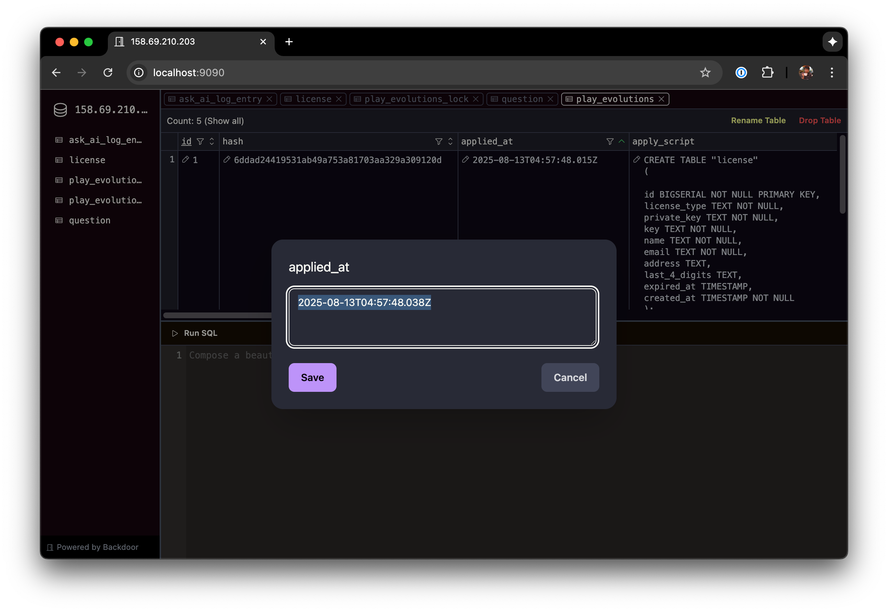

Backdoor: Self-hosted Database Querying and Editing Tool
==============================================================

[](https://central.sonatype.com/artifact/io.github.tanin47/backdoor)

[](https://codecov.io/gh/tanin47/backdoor)

_Explore data & investigate issues faster and more securely with a better database tool_

Backdoor is a self-hosted and self-contained database querying and editing tool for you and your team. No need to spend
weeks and months building an admin dashboard by yourself.

* 🔥 __<ins>Easy to setup:</ins>__ -- Takes minutes to set up for you and your team to edit, explore, and investigate
  data quickly.
* 💵 __<ins>Cost Saving:</ins>__ -- Reduces the need to build an admin dashboard. Saves weeks and months in effort.
* 🔒 __<ins>Secure:</ins>__ -- Supports masked users, so you don't have to share the database credentials. The best
  security practices
  are implemented e.g. encrypted cookies with AES-256 and proof-of-work captcha.
* ✨ __<ins>Modern UI:</ins>__ -- Exploring and investigating large data is a breeze and enjoyable. Offers modern UI with
  infinitely scrollable table.

Supported databases: Postgres and ClickHouse. Please open a github issue if you want other databases.



Try it out today and let me know if it fits what you and your team need!


How to use
-----------

There are 3 ways of using Backdoor:

1. Run as a standalone: JAR file, Docker, and Render.com.
2. Embed into your Java application and serve on a specific port.
3. Embed into your Java application and serve on your main port but at a specific path.

### Run as a standalone

__Run from the JAR file__

First, you can download the JAR file from our Maven
repository: https://central.sonatype.com/artifact/io.github.tanin47/backdoor/overview

Then, you can run the command below:

```
java -jar backdoor-2.1.0.jar \
  -port 9999 \
  -url "postgres://127.0.0.1:5432/backdoor_test,jdbc:ch://localhost:8123?user=backdoor&password=test_ch" \
  -secret-key SbZlbmJIXh \
  -user test_user:test_pass,another_user:another_pass
```

You can visit http://localhost:9999 and login with a Postgres user, a ClickHouse user, or a masked user (e.g.
`test_user` and `another_user`).

See FAQ for how authentication works.

__Using Docker__

The docker image is here: https://hub.docker.com/repository/docker/tanin47/backdoor

```
docker run -p 9999:9999 \
           --entrypoint "" \
           tanin47/backdoor:2.1.0 \
           java -jar backdoor.jar \
           -port 9999 \
           -url "postgres://127.0.0.1:5432/backdoor_test,jdbc:ch://localhost:8123?user=backdoor&password=test_ch" \
           -secret-key SbZlbmJIXh \
           -user test_user:test_pass,another_user:another_pass
```

__Using Render.com__

`render.yaml` shows a blueprint example of how to run Backdoor on Render.

### Embed and serve on a specific port

Add the dependency to your project:

```
<dependency>
    <groupId>io.github.tanin47</groupId>
    <artifactId>backdoor</artifactId>
    <version>2.1.0</version>
</dependency>
```

Then, initialize Backdoor when your Java application starts:

```
var server = new BackdoorServerBuilder()
  .addDatabaseConfig("postgres", "postgres://127.0.0.1:5432/backdoor_test", null, null)
  .addDatabaseConfig("clickhouse", "jdbc:ch://localhost:8123", "backdoor", "test_ch")
  .withPort(9999)
  .withSecretKey("SbZlbmJIXh")
  .addUser("test_user", "test_pass")
  .addUser("another_user", "another_pass")
  .build();

server.start();
```

You can login using a Postgres user. You can manage Postgres users
directly ([See instructions](https://www.postgresql.org/docs/16/database-roles.html)).

While using Postgres users is the recommended approach, using your own username and password is also supported. Please
see FAQ.

Then, when your Java application stops, make sure to stop Backdoor with:

```
server.stop();
```

### Embed and serve on a specific path

First, you must follow the steps above in order to serve Backdoor at a specific internal port.

Then, you can designate a specific path and use the below code to proxy requests to Backdoor:

```
var client = HttpClient.newHttpClient();
var httpRequest = HttpRequest
  .newBuilder()
  .uri(URI.create("http://localhost:9999" + path)) 
  .method("GET", HttpRequest.BodyPublishers.ofByteArray(new byte[0])) // Set the method and body in bytes
  .headers(/* ... */) // Forward the headers as-is.    
  .build();
var response = client.send(httpRequest, HttpResponse.BodyHandlers.ofByteArray());
```

The above code uses the HTTP client offered by Java. It doesn't require any external dependency.


Features
---------

* Support multi-databases.
* Edit a field, delete a row, sort, and filter
* Rename and drop table
* Run arbitrary SQLs
* Activity history (through regular logs).
* Support its own users, so you don't have to share the database credentials.
* Support database users e.g. logging in with Postgres or ClickHouse users.

Secure your Backdoor instance
------------------------------

While Backdoor comes with strong security limiting the session lengths and deterring brute-force attacks through a
Proof-of-Work Captcha through [altcha](https://github.com/altcha-org/altcha), you can add more layers of security.
Here are 2 more ways:

### 1. SSH tunneling

You can block your port using a firewall and use SSH tunneling to allow you to connect to a Backdoor instance.

You can run: `ssh -L <local_port>:<remote_backdoor_host>:<remote_backdoor_port> <user>@<ssh_server>` and visit:
`http://localhost:<local_port>` to access Backdoor.

### 2. VPN

Your company might already use VPN. It's a great option to connect to a server that hosts a Backdoor instance.

The setup might be complicated and overkilled, so I'd recommend using this option if your company already have a
VPN.

[Tailscale](https://tailscale.com/) is one example.

FAQ
-----

### How does the authentication work?

Backdoor supports __masked users__ and __database users__.

1. __Masked users__ are the users you set on Backdoor through `BackdoorServerBuilder.addUser(..)` or `-user`.
2. __Database users__ are the users that you set on the databases
   e.g. [Postgres users](https://www.postgresql.org/docs/16/sql-createuser.html), [ClickHouse users](https://clickhouse.com/docs/operations/settings/settings-users).

These 2 types of users work in conjunction with the database configurations as follows:

1. Any 2 type of users can login into the dashboard.
2. Any logged-in user can access any database whose config contains valid credentials.
3. If a database config doesn't contain credentials, then the logged-in user can click on the "locked" database to
   provide valid credentials for that database.

With these combinations, you can configure the authentication to fit your needs.

For simplicity, I'd recommend using masked users and providing valid credentials in all database configurations.

### How to configure the loggers?

Backdoor uses `java.util.logging`. The default logging config is at
`./src/main/java/resources/backdoor_default_logging.properties`.

If you have your own log config file, you can load it using:

```
try (var configFile = YourClass.class.getResourceAsStream("/YOUR_LOG_CONFIG_FILE")) {
  LogManager.getLogManager().readConfiguration(configFile);
  logger.info("The log config) has been loaded.");
} catch (IOException e) {
  logger.warning("Could not load the log config file: "+e.getMessage());
}
```

Contributing
==============

How to develop
---------------

1. Run `npm install` to install all dependencies.
2. Change the target database URL in `tanin.backdoor.BackdoorServier.main(..)`
2. Run `./gradlew run` in order to run the web server.
3. On a separate terminal, run `npm run hmr` in order to hot-reload the frontend code changes.

How to run tests
-----------------

1. Run `./setup/setup_db.sh` in order to set the postgres database.
2. Set up the ClickHouse instance as follows:

- The HTTP port is 8123
- The database `backdoor_test` is created.
- The username is `backdoor_test`.
- The password is `test_ch`

1. Run `npm install` to install all dependencies.
3. On a separate terminal, run `npm run hmr`.
2. Run `./gradlew test` in order to run all the tests.

Publish JAR
------------

1. Run `./gradlew clean`. This step is *IMPORTANT* for cleaning out old builds.
1. Build the tailwindbase.css with:
   `./node_modules/.bin/postcss ./frontend/stylesheets/tailwindbase.css --config . --output ./src/main/resources/assets/stylesheets/tailwindbase.css`
2. Build the production Svelte code with:
   `ENABLE_SVELTE_CHECK=true ./node_modules/webpack/bin/webpack.js --config ./webpack.config.js --output-path ./src/main/resources/assets --mode production`
3. Run `./gradlew publish`

The far JAR is built at `./build/libs/backdoor-VERSION.jar`

You can run your server with: `java -jar ./build/libs/backdoor-VERSION.jar`

To publish to a Maven repository, please follow the below steps:

1. Set up `~/.jreleaser/config.toml` with `JRELEASER_MAVENCENTRAL_USERNAME` and `JRELEASER_MAVENCENTRAL_PASSWORD`
2. Run `./gradlew jreleaserDeploy`

Publish Docker
---------------

This must be done after the JAR is published on Sonatype because the docker image will pull the new version from
Sonatype.

1. Run `docker buildx build --platform linux/amd64 -t backdoor:2.1.0 .`
2. Test locally with: `docker run -p 9090:9090 --entrypoint "" backdoor:2.1.0 java -jar backdoor.jar -port 9090`
3. Run: `docker tag backdoor:2.1.0 tanin47/backdoor:2.1.0`
4. Run: `docker push tanin47/backdoor:2.1.0`
5. Go to Render.com, sync the blueprint, and test that it works
